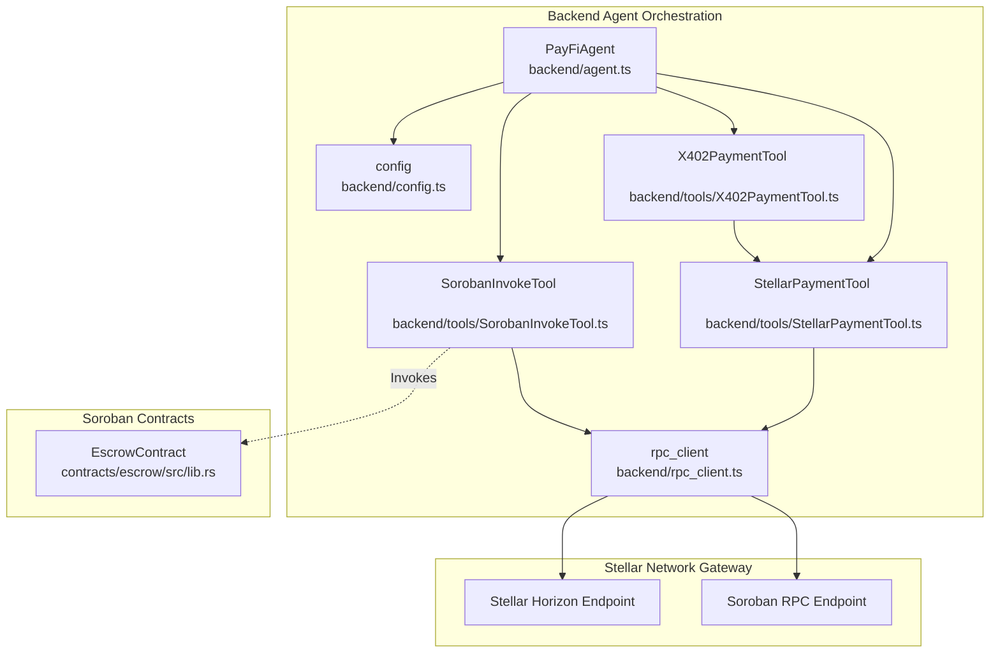
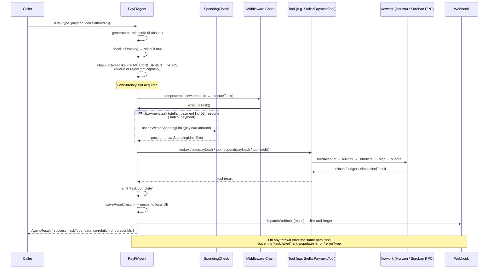
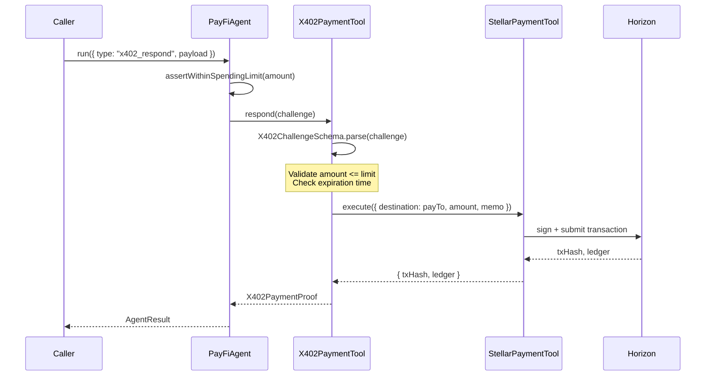

# Vela System Architecture

This document provides a deep dive into the architecture of Vela, explaining the core components, transaction lifecycles, security gates, and tool dispatch flows.

---

## Directory Structure Rationale

Vela is structured into three clean pillars to isolate concerns, simplify development, and optimize security:

```text
/
├── backend/            # Pillar 1: Agent Orchestration (TypeScript/Node.js)
│   ├── db/             # Local database layers / state tracking
│   ├── tools/          # Individual agent tools (StellarPaymentTool, SorobanInvokeTool, X402PaymentTool)
│   ├── types/          # Domain-specific type and schema validation definitions
│   ├── agent.ts        # The main orchestrator class (PayFiAgent)
│   ├── config.ts       # Secure configuration layer and environment schema validations
│   └── rpc_client.ts   # Central network gateway with observability, retries, and simulation gates
├── contracts/          # Pillar 2: Soroban Smart Contracts (Rust)
│   └── escrow/         # Production-grade Soroban escrow contract (src/lib.rs, src/test.rs)
└── tests/              # Pillar 3: Integration & E2E Tests (Vitest & TypeScript)
    ├── payment.test.ts # Stellar native/asset payment verification tests
    ├── x402.test.ts    # E2E x402 protocol integration tests
    └── soroban_invoke.test.ts # Smart contract invocation tests
```

- **`backend/`** holds the "Agent Brain." Code here handles configuration parsing, validation, task dispatching, and cryptographic credentials signing without storing keys in memory properties.
- **`contracts/`** defines the on-chain business logic using Soroban. Contracts are compiled into WebAssembly (`.wasm`) targets.
- **`tests/`** ensures E2E compatibility by spinning up isolated transaction sequences and verifying agent interaction against mock or live network endpoints.

---

## Component Dependency Diagram

The following Mermaid diagram shows the components and the flow of dependencies across the agent, tools, network client, and smart contracts:



---

## PayFiAgent Dispatch Flow

The entry point for all agent tasks is `PayFiAgent.run(task)` inside [backend/agent.ts](./backend/agent.ts). The orchestrator handles task routing, enforces spending limits, and manages execution lifecycles:

```
[ Caller ] 
    │
    │  run(task)
    ▼
[ PayFiAgent.run ] ────► [ assertWithinSpendingLimit ] 
    │                         (Checks AGENT_SPENDING_LIMIT & MAINNET_SPENDING_CAP)
    │
    ├─► "stellar_payment" ──► StellarPaymentTool.execute()
    ├─► "soroban_invoke"  ──► SorobanInvokeTool.execute()
    └─► "x402_respond"    ──► X402PaymentTool.respond()
```

1. **Task Request**: The caller calls `agent.run({ type, payload })`.
2. **Spending Guard**: If the task involves a payment (`stellar_payment` or `x402_respond`), `assertWithinSpendingLimit(amount)` is called to verify that the value does not exceed the configured `AGENT_SPENDING_LIMIT` in [backend/config.ts](./backend/config.ts) or the global `MAINNET_SPENDING_CAP` (10,000 USDC/XLM).
3. **Tool Delegation**: The agent delegates processing to the appropriate tool class instance (`paymentTool`, `sorobanTool`, or `x402Tool`).
4. **Tool Execution**: The tool uses `config.agentKeypair()` to sign transaction envelopes and submits them via [backend/rpc_client.ts](./backend/rpc_client.ts).
5. **Event Emission**: On completion or failure, the agent emits either `task:complete` or `task:failed` events.

---

## Tool Dispatch Lifecycle

This section documents the complete lifecycle of a task from the moment `PayFiAgent.run()` is called through to result serialisation, webhook delivery, and persistence. It covers the `AgentTask → AgentResult` contract, every registered task type, and the hooks that fire at each stage.

### Sequence Diagram



### `AgentTask` → `AgentResult` Contract

**`AgentTask`** is the input envelope:

```typescript
interface AgentTask {
  type: TaskType;          // identifies which tool receives the payload
  payload: unknown;        // validated inside the tool via a Zod schema
  correlationId?: string;  // optional caller-supplied ID; auto-generated if absent
}
```

**`AgentResult`** is the output envelope:

```typescript
interface AgentResult {
  success: boolean;        // true if the tool completed without throwing
  taskType: TaskType;      // echoes back the dispatched type
  data?: unknown;          // tool-specific success payload (txHash, proof, etc.)
  error?: string;          // human-readable failure message (secrets redacted)
  errorType?: string;      // machine-readable error category for programmatic branching
  correlationId?: string;  // ties every log line / webhook / DB row for this execution
  durationMs?: number;     // wall-clock time from dispatch to completion
  sequenceIndex?: number;  // zero-based position in a runSequence() call; absent on run()
}
```

On failure, `error` contains the redacted exception message. If the error is a `StructuredError` carrying context (e.g. which signer was expected vs. presented), that context is JSON-appended as `| context: {...}`. Signing material is stripped from the context before serialisation.

### Registered Task Types

Every `TaskType` value accepted by `PayFiAgent.run()` is listed below, together with the tool class that handles it and a brief description.

| `TaskType` | Tool class | Description |
|---|---|---|
| `stellar_payment` | `StellarPaymentTool` | Native XLM or custom Stellar asset payment via Horizon. Spending limit enforced before dispatch. |
| `soroban_invoke` | `SorobanInvokeTool` | Mutable Soroban smart contract invocation. Mandatory simulation gate before broadcast; `simulateOnly: true` for dry-run. |
| `soroban_query` | `SorobanQueryTool` | Read-only Soroban contract state inspection. Always simulates, never broadcasts. |
| `x402_respond` | `X402PaymentTool` | Respond to an x402 `402 Payment Required` challenge. Validates challenge schema, enforces spending limit, delegates payment to `StellarPaymentTool`, returns `X402PaymentProof`. |
| `account_info` | `AccountInfoTool` | Fetch the agent's balances, sequence number, and subentry count from Horizon. Read-only. |
| `change_trust` | `TrustlineTool` | Add or remove a custom asset trustline on the agent's account. |
| `multisig_payment` | `MultiSigPaymentTool` | Build M-of-N multisig payment transactions. Returns `unsignedXDR` until enough signatures are collected, then submits. |
| `batch_payment` | `BatchPaymentTool` | Submit up to 100 payments in a single atomic transaction envelope. Aggregate spending limit enforced. |
| `balance_check` | `BalanceCheckTool` | Query asset balances for any Stellar account (not just the agent). |
| `path_payment` | `PathPaymentTool` | Cross-asset `pathPaymentStrictSend` via the Stellar DEX. |
| `fee_bump` | `FeeBumpTool` | Wrap a pre-built transaction XDR in a fee-bump envelope for sponsored retry flows. |
| `dex_offer` | `DexOfferTool` | Create, update, or delete a manage-sell offer on the Stellar DEX. |
| `liquidity_pool` | `LiquidityPoolTool` | Interact with Stellar AMM liquidity pools (deposit, withdraw, query). |
| `stellar_toml` | `StellarTomlTool` | Fetch and parse a `stellar.toml` from a domain's well-known endpoint. |
| `data_entry` | `DataEntryTool` | Set or delete arbitrary key-value data entries on the agent's account. |
| `sequence_number` | `SequenceNumberTool` | Fetch or bump the agent's current sequence number. |
| `sponsored_account` | `SponsoredAccountTool` | Create a new Stellar account with sponsored reserves. |
| `anchor_quote` | `AnchorQuoteTool` | Fetch an SEP-38 quote from an anchor for asset conversion. |
| `inflation` | `InflationTool` | Set or query the account's inflation destination. |

### Lifecycle Hooks

The following hooks fire in order around every task execution:

1. **Draining check** — if `agent.drain()` has been called, new tasks are rejected immediately with `"Agent is shutting down — task rejected"`.
2. **Concurrency gate** — tasks that arrive while `activeTasks >= MAX_CONCURRENT_TASKS` are either queued (bounded by `QUEUE_CAPACITY`) or rejected.
3. **Middleware chain** — registered via `agent.use(fn)`. Runs in FIFO registration order; each middleware calls `next()` to continue. A middleware can short-circuit by returning a result without calling `next()`.
4. **Spending limit guard** — called inside `executeTask()` for payment-bearing task types before the tool is invoked. Throws synchronously on violation.
5. **Tool execution** — the matching tool's method is called with `task.payload`.
6. **`task:complete` / `task:failed` event** — emitted on the `PayFiAgent` EventEmitter so external listeners can react without polling.
7. **`saveResult`** — persists the `AgentResult` (plus a `timestamp`) to the local DB via `backend/persistence.ts`.
8. **`dispatchWebhook`** — fire-and-forget POST to `WEBHOOK_URL` (if configured) with the serialised `AgentResult`. Errors in webhook delivery are logged but do not affect the returned result.

### Error Serialisation

All errors thrown inside a tool are caught by `executeTask()`'s `try/catch`. The error message is processed as follows before it reaches `AgentResult.error`:

1. `describeError(err)` — extracts the `.message` string; if the error is a `StructuredError` with a `.cause`, the sanitised cause is JSON-appended.
2. `sanitizeCause(cause)` — strips keys matching `secretKey | privateKey | seed | _secretKey` from the cause before serialisation.
3. `redactSecretString(message)` — regex-replaces any bare Stellar secret key (56-char `S…` string) with `[REDACTED]` as a final safety net.

The resulting string is stored in `AgentResult.error` and forwarded verbatim to the webhook payload and the persisted DB row.

---

## The Mandatory Simulation Gate

To prevent lost fees and broadcast failures, all Soroban contract transactions must pass through a simulation gate prior to network submission. This logic is centered in [backend/rpc_client.ts](./backend/rpc_client.ts) inside the `prepareSorobanTx` function:

```
[ Transaction built with BASE_FEE ]
                 │
                 ▼
     [ simulateSorobanTx(tx) ] ── (Queries Soroban RPC) ──► [ simResult ]
                 │                                               │
                 ▼                                               ▼
      Is simulation an error? ◄───────────────────────── rpc.Api.isSimulationError?
         /           \
       YES            NO
       /                \
[ Throw Error ]      [ rpc.assembleTransaction(tx, simResult).build() ]
                      (Adds footprints, footprint fees, & resource bounds)
```

1. **Simulation Query**: `simulateSorobanTx(tx)` invokes the `simulateTransaction` RPC endpoint.
2. **Result Verification**: `rpc.Api.isSimulationError(simResult)` checks if transaction execution failed (e.g. invalid arguments, auth failure, or budget exhaustion). If true, it throws an error immediately.
3. **Footprint Assembly**: `rpc.assembleTransaction` merges the simulation footprint data (specifying read/write storage keys) and resource fees back into the original transaction envelope.
4. **Broadcast Readiness**: The returned fully-assembled transaction can then be signed by the caller and safely broadcast to the network.

---

## Escrow Lifecycle State Machine

The smart contract in [contracts/escrow/src/lib.rs](./contracts/escrow/src/lib.rs) manages locked token deposits and restricts access using a 3-state state machine:

```
    [ Uninitialized ]
           │
           │  initialize() (Depositor transfers funds, stores keys)
           ▼
       [ Active ]
         ╱    ╲
        ╱      ╲  refund() (Depositor reclaims after expiry time)
       ╱        ╲
      ╱          ▼
     │       [ Settled ] (Funds returned to depositor)
     │
     │  release() (Arbiter releases to recipient)
     ▼
 [ Settled ] (Funds sent to recipient)
```

- **`Uninitialized`**: The contract storage has no `DataKey::Depositor` key. Calling any function other than `initialize` will panic.
- **`Active`**: The contract is initialized. Funds are held in the contract account. `Released` key is `false`.
- **`Settled`**: Settled state where the `Released` key is updated to `true`. This prevents subsequent releases or refunds (preventing double-spend).

---

## x402 Challenge-Response Flow

Vela implements the `x402` payment protocol via `X402PaymentTool.ts` to allow autonomous payment responses for gated resource challenges:



- **Challenge Parsing**: The response payload must match the `X402ChallengeSchema` (valid URL `resource`, `amount`, `payTo` address, `nonce` UUID, and `expiresAt` datetime).
- **Nonce-to-Memo Truncation**: Because Stellar memos are limited to 28 bytes while UUIDs are 36 characters, the tool truncates the UUID nonce to fit the memo: `challenge.nonce.slice(0, 28)`.
- **Proof Return**: On successful payment, the tool returns an `X402PaymentProof` holding the original challenge `nonce`, the settled `txHash`, the `payer` G-address, and metadata, which the resource server can inspect and verify.

---

## Tool Modules

All tools live in `backend/tools/`. Each tool is a self-contained class responsible for one category of network interaction. The agent (`PayFiAgent`) instantiates tools in its constructor and dispatches to them from `run()`.

### Existing Tools

#### `StellarPaymentTool`

**File:** `backend/tools/StellarPaymentTool.ts`  
**Task type:** `stellar_payment`  
**Purpose:** Native XLM or custom asset payment via Horizon.

Key design decisions:
- Validates input with `PaymentInputSchema` (Zod) before touching the network. Amount must be a positive Stellar decimal (up to 7 decimal places); destination must be a 56-char G-address; memo capped at 28 bytes.
- Rejects self-payments: the destination cannot equal the agent's own public key.
- Non-XLM payments require an `assetIssuer`. The tool throws immediately if one is missing rather than producing an ambiguous network error.
- **Simulation exemption:** Horizon has no simulation endpoint. The tool validates the transaction envelope locally, then signs and submits directly. There is no Soroban-style simulation pass on this path. See [The Mandatory Simulation Gate](#the-mandatory-simulation-gate) for why Soroban tools require simulation but Horizon tools do not.
- Auto-retries once on `tx_bad_seq` by reloading the account's sequence number and rebuilding the transaction.
- Returns `{ txHash, ledger }` on success.

---

#### `SorobanInvokeTool`

**File:** `backend/tools/SorobanInvokeTool.ts`  
**Task type:** `soroban_invoke`  
**Purpose:** Invoke any mutable Soroban smart contract function with mandatory simulation before broadcast.

Key design decisions:
- **Mandatory simulation gate** — every call passes through `prepareSorobanTx()` in `rpc_client.ts` before any broadcast attempt. `prepareSorobanTx` calls `simulateTransaction` on Soroban RPC, checks for `isSimulationError`, and merges the returned resource footprint back into the transaction. If simulation fails, the tool throws immediately and nothing is broadcast.
- `simulateOnly: true` (optional flag) — runs the full simulation path but returns `{ simulationResult: Transaction }` instead of broadcasting. Use this for dry-runs, fee estimation, and contract logic validation.
- Fee guard: after simulation, the assembled fee is compared against `config.MAX_SOROBAN_FEE_STROOPS`. If it exceeds the cap, the tool throws before signing.
- Time-bound safety: `setTimeout(0)` is rejected at broadcast time. Every broadcast transaction must carry a positive timeout so that it cannot be replayed indefinitely.
- Polls Soroban RPC (`getTransaction`) up to 10 times at 2-second intervals after submission to confirm the transaction reached `SUCCESS` or `FAILED`.
- Return type is a discriminated union: `{ txHash: string }` when broadcast, `{ simulationResult: Transaction }` when simulate-only. Use the exported `isSorobanSimulationResult()` type guard to narrow the result.

---

#### `SorobanQueryTool`

**File:** `backend/tools/SorobanQueryTool.ts`  
**Task type:** `soroban_query`  
**Purpose:** Read-only contract state inspection. Always simulate-only, never broadcasts.

Key design decisions:
- A simplified, non-polymorphic version of `SorobanInvokeTool`. There is no `simulateOnly` flag — the tool always simulates and never broadcasts, so the return type is always `{ simulationResult: unknown }`.
- Uses `setTimeout(0)` intentionally: because the transaction is never broadcast, there is no replay risk and no time-bound requirement.
- Does not sign the transaction. The keypair is present only to satisfy the `loadAccount` call (Soroban simulation requires a valid source account).
- Appropriate for contract getter methods (`get_state`, `balance`, etc.) where side effects are not intended.

---

#### `X402PaymentTool`

**File:** `backend/tools/X402PaymentTool.ts`  
**Task type:** `x402_respond`  
**Purpose:** Respond to an x402 machine-to-machine payment challenge autonomously.

Key design decisions:
- Delegates the actual payment to `StellarPaymentTool.execute()` internally. It is not a standalone network client — it is an orchestration layer on top of the payment tool.
- Validates the challenge against `X402ChallengeSchema` before doing anything else. Invalid challenges (bad URL, expired `expiresAt`, malformed nonce) are rejected without touching the network.
- **Rate limiting:** enforces `config.MAX_X402_PAYMENTS_PER_MINUTE` in a sliding 60-second window. Exceeding the limit throws immediately.
- **Nonce deduplication:** stores used nonces in a `Set`. Replaying the same nonce throws `"x402: nonce already used"`. Note: the current implementation is in-memory only; a multi-instance deployment would need Redis or a shared store.
- **Origin allowlist:** if `ALLOWED_X402_ORIGINS` is set, the tool extracts the hostname from `challenge.resource` and rejects unlisted origins.
- **Memo derivation:** computes `SHA-256(nonce)` and takes the first 28 hex characters as the Stellar text memo. A resource server verifying the proof must apply the same derivation to correlate the on-chain memo with the original challenge nonce.
- **Simulation exemption:** delegates payment to `StellarPaymentTool`, which is Horizon-only and carries the same simulation exemption as described above.
- Returns an `X402PaymentProof` containing `{ protocol, network, txHash, nonce, payer, signedAt }`.

---

#### `PathPaymentTool`

**File:** `backend/tools/PathPaymentTool.ts`  
**Task type:** `path_payment`  
**Purpose:** Cross-asset payment via Stellar's `pathPaymentStrictSend` operation — send one asset, recipient receives a different asset, routed through the Stellar DEX.

Key design decisions:
- `sendAmount` is the exact amount the agent sends. `destMinAmount` is the minimum the recipient must receive; the transaction fails on-chain if DEX slippage causes the output to fall below this floor.
- `path` is an optional array of intermediate assets. If omitted, Horizon attempts to find a path automatically.
- **Simulation exemption:** Horizon-only, same rationale as `StellarPaymentTool`. Signs and submits directly.
- Auto-retries once on `tx_bad_seq`, matching the pattern used by `StellarPaymentTool`.
- Returns `{ txHash, ledger }` on success.

---

#### `FeeBumpTool`

**File:** `backend/tools/FeeBumpTool.ts`  
**Task type:** `fee_bump`  
**Purpose:** Wrap an existing transaction XDR in a fee-bump envelope so the agent can sponsor fees for a transaction signed by a different account (e.g. when the inner transaction's original fee is too low to clear the network).

Key design decisions:
- Accepts `innerTxXdr` — a base64 XDR-encoded `Transaction`. Rejects if it is itself a `FeeBumpTransaction` (no nested fee-bumps).
- `baseFeeMultiplier` (default: `2`) scales the inner transaction's per-operation fee. The fee-bump fee is calculated as `(operationCount + 1) * newFeePerOp` per Stellar protocol requirements.
- `feeAccount` defaults to the agent's own public key when not provided.
- **Simulation exemption:** Horizon-only. Signs and submits directly.
- Returns `{ txHash, ledger }` on success.

---

#### `MultiSigPaymentTool`

**File:** `backend/tools/MultiSigPaymentTool.ts`  
**Task type:** `multisig_payment`  
**Purpose:** Build M-of-N multi-signature payment transactions for high-value operations requiring multiple approvals.

Key design decisions:
- `minSignatures` must not exceed the total number of available signers (agent + `additionalSigners.length`). Throws immediately if this invariant is violated.
- **Two-phase flow:** if `signatures` are not yet provided (or insufficient), the tool returns `{ unsignedXDR }` — the unsigned transaction XDR for out-of-band collection. Once enough signatures are provided, it signs and submits, returning `{ txHash, ledger }`.
- **Simulation exemption:** Horizon-only payment operation. Signs and submits directly.

---

#### `TrustlineTool`

**File:** `backend/tools/TrustlineTool.ts`  
**Task type:** `change_trust`  
**Purpose:** Add or remove asset trustlines on the agent's account.

Key design decisions:
- `action: "add"` calls `changeTrust` with an optional `limit`. `action: "remove"` passes `limit: "0"` to revoke the trustline.
- Exposes a `checkTrustline(assetCode, assetIssuer)` helper that returns a boolean without building a transaction — useful for pre-flight checks before attempting asset payments.
- **Simulation exemption:** Horizon-only. Signs and submits directly.

---

#### `AccountInfoTool`

**File:** `backend/tools/AccountInfoTool.ts`  
**Task type:** `account_info`  
**Purpose:** Fetch the agent's current balances, sequence number, and subentry count from Horizon.

Key design decisions:
- Read-only. Makes a single `loadAccount` call and maps the raw Horizon response into a typed `AccountInfo` struct.
- No input schema needed — always fetches the agent's own account (`config.AGENT_PUBLIC_KEY`).
- No simulation exemption discussion applies: no transaction is built or submitted.

---

#### `BalanceCheckTool`

**File:** `backend/tools/BalanceCheckTool.ts`  
**Purpose:** Query asset balances for any Stellar account (not just the agent's own).

Key design decisions:
- Accepts a `publicKey` parameter, making it useful for inspecting counterparty accounts before executing a payment.
- Optional `assetCode` / `assetIssuer` filters narrow the response to a specific asset. Without filters, all balances are returned.
- Read-only. No transaction is built or submitted. Not currently wired into the `run()` dispatch switch; intended for direct instantiation in utility scripts.

---

### The Standard Tool Pattern

Every tool that submits a transaction follows this sequence:

```
1. Zod schema parse (PaymentInputSchema.parse / SorobanInvokeInputSchema.parse / …)
       │  Throws ZodError on invalid input — nothing network-related is attempted
       ▼
2. Pre-flight guards (self-payment check, asset issuer presence, minSignatures check, …)
       │  Throws a descriptive Error — fast-fail before touching the network
       ▼
3. loadAccount(publicKey)
       │  Fetches the latest sequence number from Horizon/Soroban RPC
       ▼
4. TransactionBuilder → .addOperation(…) → .setTimeout(…) → .build()
       │  Constructs the unsigned transaction envelope
       ▼
5. [Soroban tools only] prepareSorobanTx(tx)   ← MANDATORY simulation gate
       │  Calls simulateTransaction on Soroban RPC; throws on simulation error;
       │  merges resource footprint and fee into the transaction
       ▼  (Horizon-only tools skip this step entirely — see exemption below)
6. tx.sign(keypair)
       │  Signs with config.agentKeypair()
       ▼
7. submitTransaction(tx) / sorobanServer.sendTransaction(tx)
       │  Broadcasts to network
       ▼
8. Return result shape   { txHash, ledger }  |  { simulationResult }  |  X402PaymentProof
```

### Simulation Gate Requirement

The mandatory simulation gate applies to **all Soroban (smart contract) tools**:

| Tool | Simulation required | Reason |
|---|---|---|
| `SorobanInvokeTool` | Yes — always | Soroban transactions require a resource footprint that can only be obtained from `simulateTransaction`. Without it the transaction is rejected by the RPC node. Simulation also catches auth failures and budget exhaustion before any fee is spent. |
| `SorobanQueryTool` | Yes — always | Read-only, but still uses `prepareSorobanTx` to validate the call and obtain the result. Never broadcasts. |
| `StellarPaymentTool` | **Exempt** | Horizon Classic operations do not use the Soroban resource model. There is no `simulateTransaction` endpoint for Horizon. The tool validates the envelope locally and submits directly. |
| `PathPaymentTool` | **Exempt** | Horizon Classic operation — same rationale as above. |
| `FeeBumpTool` | **Exempt** | Wraps a pre-built inner transaction. The inner transaction was already validated when it was originally built. |
| `MultiSigPaymentTool` | **Exempt** | Horizon Classic payment operation. |
| `TrustlineTool` | **Exempt** | Horizon Classic `changeTrust` operation. |
| `AccountInfoTool` | N/A | Read-only Horizon query, no transaction built. |
| `BalanceCheckTool` | N/A | Read-only Horizon query, no transaction built. |
| `X402PaymentTool` | **Exempt** (delegates to `StellarPaymentTool`) | The underlying payment is a Horizon Classic operation. |

**Why this matters for security:** The simulation gate is the primary mechanism preventing wasted fees and failed broadcasts for Soroban calls. A simulation failure surfaces contract-level errors (wrong argument types, insufficient authorization, state violations) in the agent before the transaction is signed or broadcast. Horizon tools do not have an equivalent endpoint — their pre-flight is limited to local envelope validation.

---

### Adding a New Tool

Use this checklist when contributing a new tool to `backend/tools/`.

**1. Create the tool file**

```
backend/tools/MyNewTool.ts
```

**2. Define and export a Zod input schema**

Every tool that accepts input must validate it with a named, exported schema. This enables tests to import and exercise schema validation in isolation.

```typescript
export const MyNewInputSchema = z.object({
  destination: z.string().length(56, "Invalid Stellar public key"),
  amount: z
    .string()
    .regex(/^(?!0(\.0+)?$)\d+(\.\d{1,7})?$/, "Amount must be a valid Stellar decimal")
    .refine((v) => parseFloat(v) > 0, "Amount must be greater than zero"),
  // ... other fields
});

export type MyNewInput = z.infer<typeof MyNewInputSchema>;
```

**3. Implement the tool class following the standard pattern**

```typescript
export class MyNewTool {
  private keypair: Keypair;
  private networkPassphrase: string;

  constructor(secretKey: string = config.agentKeypair().secret()) {
    this.keypair = Keypair.fromSecret(secretKey);
    this.networkPassphrase = resolveNetworkPassphrase(config.STELLAR_NETWORK);
  }

  async execute(rawInput: unknown): Promise<{ txHash: string; ledger: number }> {
    // 1. Validate
    const input = MyNewInputSchema.parse(rawInput);

    // 2. Pre-flight guards (e.g. self-payment check)

    // 3. Load account
    const account = await loadAccount(this.keypair.publicKey());

    // 4. Build transaction
    const tx = new TransactionBuilder(account, { fee: BASE_FEE, networkPassphrase: this.networkPassphrase })
      .addOperation(/* ... */)
      .setTimeout(30)
      .build();

    // 5. Simulate (Soroban tools ONLY — omit for Horizon Classic operations)
    // const preparedTx = await prepareSorobanTx(tx);

    // 6. Sign
    tx.sign(this.keypair);

    // 7. Submit
    const result = (await submitTransaction(tx)) as { hash: string; ledger: number };
    return { txHash: result.hash, ledger: result.ledger };
  }
}
```

**4. Decide whether your tool requires the simulation gate**

- Does it invoke a **Soroban contract**? → Call `prepareSorobanTx(tx)` before signing. This is mandatory, not optional.
- Does it use a **Horizon Classic operation** (payment, changeTrust, pathPaymentStrictSend, feeBump, manageData, …)? → Skip `prepareSorobanTx`. Validate the envelope locally and submit directly.

**5. Add a `TaskType` entry**

In `backend/agent.ts`, add your new type to the union:

```typescript
export type TaskType =
  | "stellar_payment"
  | "soroban_invoke"
  // ...
  | "my_new_task";   // ← add here
```

**6. Wire the tool into `PayFiAgent`**

In `backend/agent.ts`:

```typescript
// In the constructor:
this.myNewTool = new MyNewTool(config.agentKeypair().secret());

// In the run() switch:
case "my_new_task":
  data = await this.myNewTool.execute(task.payload);
  break;
```

**7. Add a spending-limit guard if your tool moves value**

If your tool accepts an `amount` field that moves funds, call `assertWithinSpendingLimit` in the `run()` case before delegating:

```typescript
case "my_new_task": {
  const p = task.payload as Record<string, unknown>;
  assertWithinSpendingLimit(p?.amount);
  data = await this.myNewTool.execute(task.payload);
  break;
}
```

**8. Write tests**

- Unit test the Zod schema for valid and invalid inputs.
- Unit test the tool class with mocked `loadAccount` and `submitTransaction` (or `prepareSorobanTx`).
- Add an integration test in `tests/` that exercises the full `PayFiAgent.run()` path with a mocked or testnet network.

**9. Update this document**

Add an entry for your tool under [Existing Tools](#existing-tools) above, describing its purpose, key design decisions, and simulation gate status.
